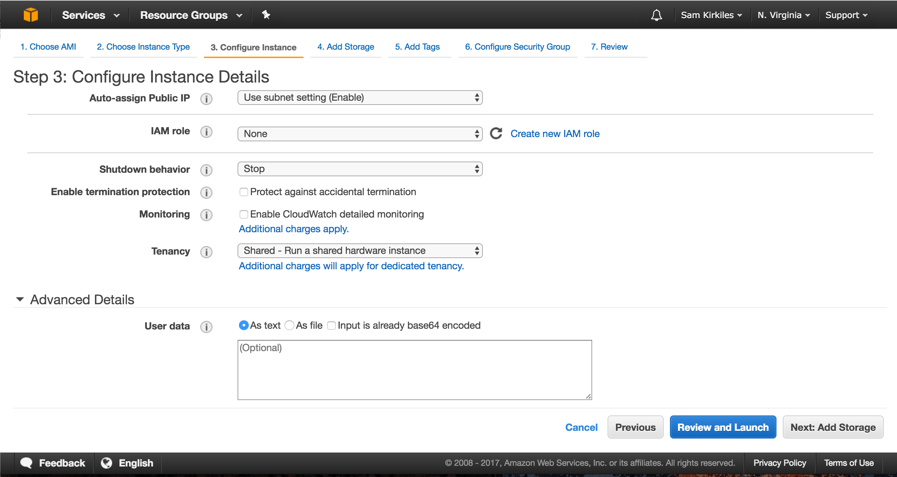
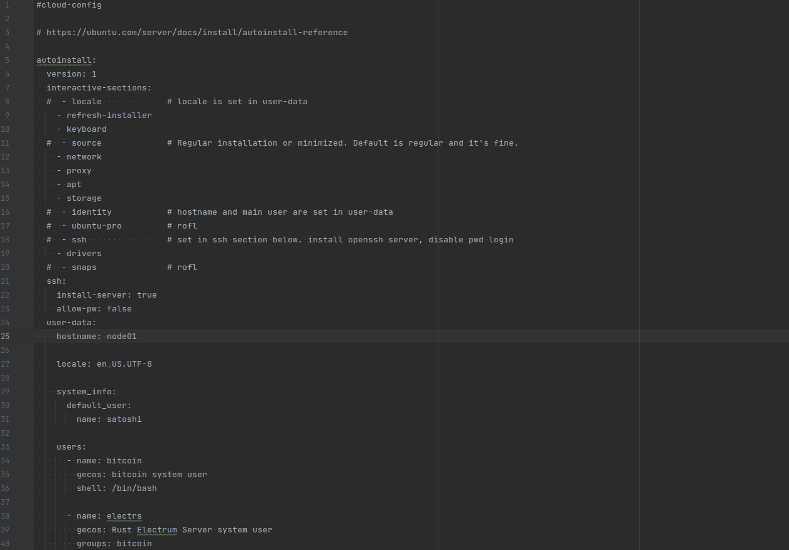
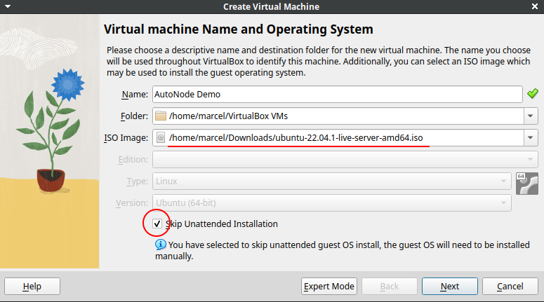
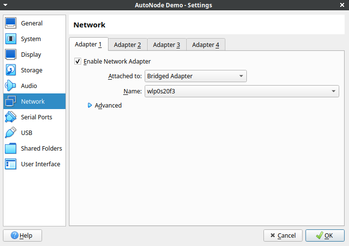
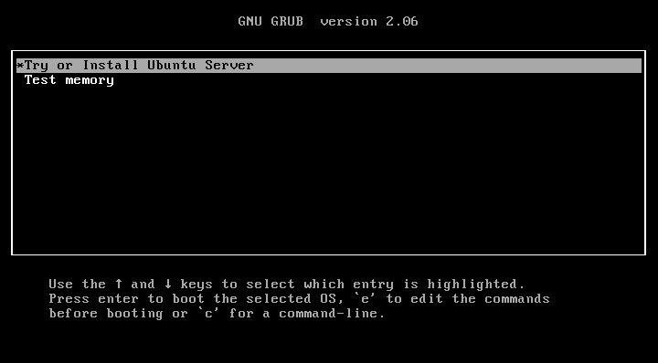
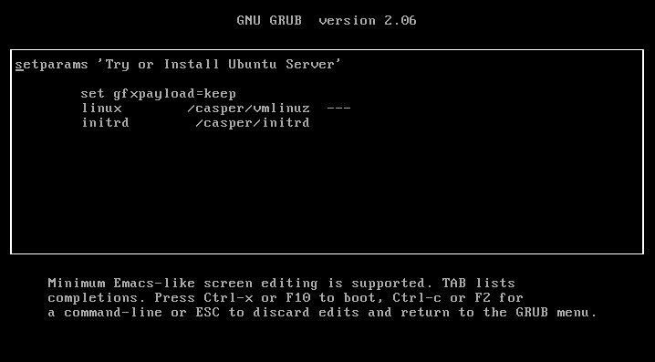
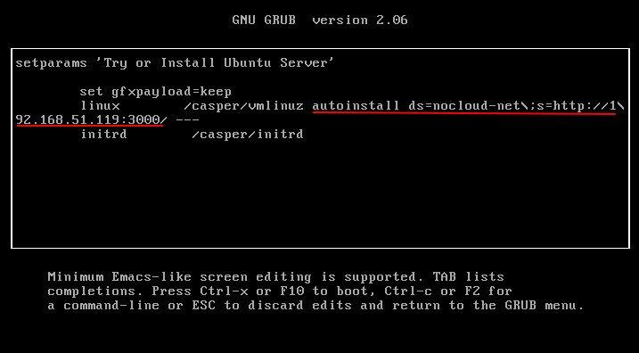
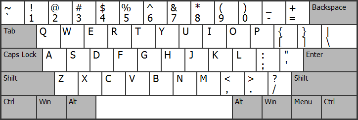
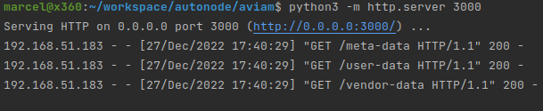
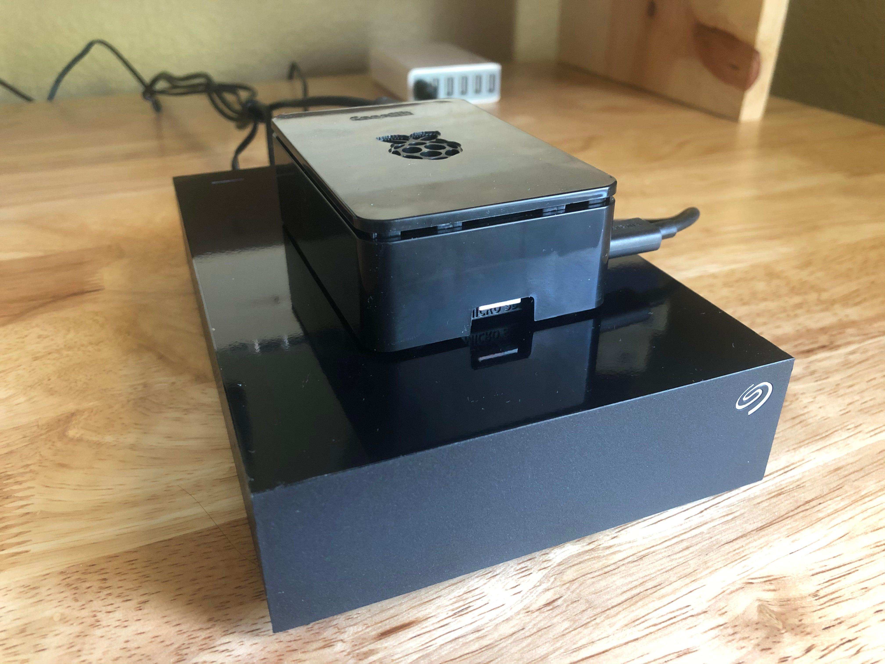

# AutoNode

A [cloud-init](https://cloud-init.io) template to build Bitcoin nodes automatically.

## Target Users

> "Ain't nobody got time to sit through [RaspiBolt](https://raspibolt.org/) more than once. Once you've learned how to build a Bitcoin node with your hands the next ones should just build themselves."
>
> — Me

AutoNode is designed to automate the initial installation of Bitcoin+Lightning nodes while still retaining the transparency that most other ready-made solutions lack.
As such, it's not very suitable for first time node builders.

If you've never built a Do-It-Yourself (DIY) node I encourage you to instead check out [RaspiBolt](https://raspibolt.org/) or its Intel/AMD fork, [MiniBolt](https://raspibolt.org/).
If you prefer the video format check out 402PaymentRequired's excellent [Bitcoin & Lightning Server](https://www.youtube.com/watch?v=_Hrnls92TxQ) walkthrough that does the job in less than an hour.

Once you've built at least one node you'll recognize most of the elements of the AutoNode template even if you've never used cloud-init, and you'll be able to tailor it to your own taste.

## Node Services

| Service              | Version  | Local Ports (127.0.0.1) | Tor Hidden Service | Nginx TLS (0.0.0.0) | Depends on            |
|----------------------|----------|-------------------------|--------------------|---------------------|-----------------------|
| [Bitcoin Core]       | v23.2    | :8333 :8332 (rpc)       | :8333              | No                  | Nothing               |
| [Electrs Server]     | v0.10.0  | :50001                  | :50001             | :50011              | Bitcoin Core          |
| [BTC RPC Explorer]   | v3.4.0   | :3002                   | :80                | :3012               | Bitcoin Core, Electrs |
| [Core Lightning]     | v23.05.2 | :9735                   | :9735              | No                  | Bitcoin Core          |
| [c-lightning-REST]   | v0.10.5  | :3001 :4001 (doc)       | :3001 :4001 (doc)  | :3011 :4011 (doc)   | Core Lightning        |
| [Ride The Lightning] | v0.14.0  | :3000                   | :80                | :3010               | Core Lightning        |

The OpenSSH server is also exposed as a Tor hidden service on port 22.

### Other Software

* Sparrow Server 1.7.8
* WireGuard
* tmux
* rust-teos Watchtower plugin for Core Lightning

## Organization

The admin user is named `satoshi`, and is the only user in the system that has sudo permission.
The only way to SSH into the node is through this user, and you can only do so through public key authentication (password authentication is disabled).
Satoshi can run the `bitcoin-cli` and `lightning-cli` commands, query all journalctl logs and edit the system services with systemctl.

Each service has its own systemd service configuration at `/etc/systemd/system`, and its own dedicated user to run these services in isolation.
Source code, configuration files and data directories are located in the home directory of each of these system users. Satoshi can impersonate each
of these users with the su command, e.g. `sudo su - electrs` if you need to update or tweak the configuration of any of these programs.
Also, a few of the binaries that are built by hand are installed in `/usr/local/bin`.

After installation all services are already up and running, though they won't be of much use until Bitcoin Core completes the Initial Block Download (IBD).

## Installation

In all cases, using AutoNode involves providing the YAML template somehow to the machine the first time it boots.
The specific procedure depends on which kind of machine you want to use AutoNode on.

### Use it on a Raspberry Pi (easy)

#### Requirements
* A Raspberry Pi 3 or 4
* An external disk with 1TB of space or more
* A microSD card


### Use it on a cloud provider (easy)

#### Requirements
* An account at AWS or any other cloud provider that supports cloud-init.

cloud-init was originally invented to provision Ubuntu servers on AWS EC2, accordingly this is one
of the easiest installation procedures.

From the EC2 panel, launch a new instance and provision enough extra storage for the blockchain.
When you see the "User Data" form simply copy-paste the YAML template into it. Done.

|  |
|:--:|
| *AWS user data form* |

### Use it on Vagrant (medium)

#### Requirements
* [VirtualBox](https://www.virtualbox.org/wiki/Downloads)
* [Vagrant](https://developer.hashicorp.com/vagrant/downloads)

Vagrant is a good option to test your custom modifications to the cloud-init template before using it on
real hardware, or simply to get familiar with the installation process.

By default Vagrant creates virtual machines with 40GB of disk. Obviously this won't be enough to do a
full sync, but there's enough leeway to tinker with it, even for hours.

1. After installing Vagrant and VirtualBox, install the Vagrant env plugin: `vagrant plugin install vagrant-env`
2. Clone the AutoNode repo and cd into it.
3. Tweak the config.yml to your liking and the `vb.cpus` and `vb.memory` options from the Vagrantfile (might be too hefty for your machine).
4. Run `vagrant up`. This will take some time. While you wait you can open another terminal and log in as satoshi and tail the `/var/log/cloud-init-output.log` file.
   ```
    $ ssh -p 2222 -o UserKnownHostsFile=/dev/null satoshi@localhost
    $ sudo tail -f /var/log/cloud-init-output.log
   ```
5. After cloud-init completes `vagrant up` will end its execution with an error. This is normal, because cloud-init will reboot the virtual machine and Vagrant does not expect that.
6. After the second boot the node is ready to log in again. All services should be running.
7. When you're done, exit the virtual machine and run `vagrant destroy` on the same project directory.

### Use it on bare metal (hard)

#### Requirements
* Any sort of physical x86_64 machine plugged to Ethernet
* A keyboard and monitor to begin the installation
* A USB stick to hold the installation medium (Ubuntu Server ISO)
* A second laptop or desktop machine connected to the same LAN as the node.

These requirements can be simulated with a VirtualBox machine running in *briged mode* so that the home router assigns it
an IP as if it was a real device on your network.
It is important that the node is connected to Ethernet because it needs to have LAN connectivity during the installation boot.
On a WiFi network it won't have the credentials to connect.

This walkthrough will use this approach. The host operating system will act the "second machine", and the virtual machine as the node.

1. Create a new directory called whatever you want, and create three empty files in it: `user-data`, `meta-data` and `vendor-data`.
   ```
   $ mkdir temp
   $ cd temp
   $ touch user-data meta-data vendor-data
   ```
2. Copy your AutoNode template content into the `user-data` file.
3. Remove the first line (`#cloud-init`) and indent the whole file by **4 extra spaces**.
4. Copy the contents of `autoinstall.yml` at the top of the file. The AutoNode template must end up nested below the `user-data:` section **by 2 spaces**.

   |  |
   |:--:|
   | *Properly constructed user-data file. The commented lines of interactive-sections can be removed.* |
5. Run a temporary HTTP fileserver from inside the directory. You can do that easily with Python. Here I bind the port to 3000 but the exact number doesn't matter, only that the port is free:
   ```
   $ cd temp
   $ python3 -m http.server 3000
   Serving HTTP on 0.0.0.0 port 3000 (http://0.0.0.0:3000/) ...
   ```
6. Check that the file server works as expected. Access `http://localhost:3000/user-data` with your browser or cURL, and you should see the contents of the `user-data` file.
   Leave the file server running.
7. Head for the [Ubuntu Server download page](https://ubuntu.com/download/server) and download the ISO for the latest Long Term Stable (LTS) release. Currently this is the 22.04.1 release.
8. Check your machine's IP. In Linux you can do this with the `ifconfig` command. From now on we'll assume it is `192.168.1.10`.
9. In VirtualBox, Select "New" and create a new virtual machine using the ISO you just download. Be sure to check the "Skip Unattended Installation" checkbox.

   |  |
   |:--:|
10. Before starting the virtual machine for the first time, go to its Settings > Network and change NAT to Bridged Adapter.

   |  |
   |:--:|
11. Click Run, and as soon as the GRUB screen appears, press the letter `e`. This will land you into GRUB's boot editor:

   |  |
   |:--:|
   |  |
12. Move the cursor behind the three dashes and write:
   ```
   autoinstall ds=nocloud-net\;s=http://192.168.1.10:3000/
   ```
   You must write it exactly the same as shown. Mind the backward slash before the semicolon, and the last slash after the port number. *Nothing is optional*.

   This step will be tricky if you (like me) aren't using a standard US keyboard, because at this stage the computer hasn't loaded the correct keyboard layout.
   You can help yourself with an image of the US keyboard layout. Once you are done, press `F10` to resume the boot.

   |  |
   |:--:|
   | *A properly edited boot entry* |
   |  |
   | *The standard US keyboard layout* |
13. After you press `F10` the boot will start and the Ubuntu Server's installation wizard will eventually appear on screen.
    If you did everything correctly you'll see in the file server logs that 'someone' accessed the three files you prepared during the first part of the setup.
    Another way to tell that everything went OK is that the first screen of the Ubuntu wizard will be the Keyboard Layout selection instead of the system Language (language is handled by AutoNode).

   |  |
   |:--:|
   | *The boot sequence has read the cloud-init template, success.* |

14. Proceed with the Ubuntu Server installation. It will have fewer screens than usual because some of them are handled by AutoNode. Once the installation completes and the node reboots for the first time
    AutoNode will kick in and begin installing the Bitcoin software.
    If you have your SSH keys at hand you'll be able to SSH into the node as `satoshi` in about a minute after the boot and follow the cloud-init logs until it finishes and reboots the machine again:
    ```
    $ ssh satoshi@192.168.1.15
    $ sudo tail -f /var/log/cloud-init-output.log
    ```

## Post Installation

After the installation completes and the node boots for a second time you can log in with the admin user `satoshi`.
SSH password authentication is disabled out of the box, you must use a public SSH key to authenticate.

```shell
ssh satoshi@192.168.1.100
```

On Vagrant the SSH service will be exposed at localhost port 2222:

```shell
ssh -o UserKnownHostsFile=/dev/null -p 2222 satoshi@localhost
```

The `UserKnownHostsFile=/dev/null` option will prevent you from polluting your user's `.ssh/known_hosts`
file with ephemeral node public keys. You don't need to use this option when logging in to a real node.

You can also log in during the first boot and tail the cloud-init log file to be able to see what the node is exactly doing.
For that to work you usually need to wait a few seconds for cloud-init to register your public SSH key into the admin user.

```shell
ssh satoshi@192.168.1.100

# inside the node
sudo tail -f /var/log/cloud-init-output.log
```

### Check Services Health

After the second boot check the health of all services that AutoNode built:

```shell
systemctl status bitcoin.service
systemctl status electrs.service
systemctl status btcexp.service
systemctl status cln.service
systemctl status rtl.service

bitcoin-cli -getinfo
lightning-cli getinfo
```

If anything looks amiss you'll find any installation errors in these cloud-init log files:

```
/var/log/cloud-init-output.log
/var/log/cloud-init.log
```

From outside the node, you can try accessing a few of the HTTP services with your web browser.
Ride The Lightning and BTC RPC Explorer should be available straight away.
On Vagrant, they'll be accessible from `https://localhost:3010` and `https://localhost:3012`.
On a real installation you'll have to use the node IP.

### Lock down admin user

The default administrator account is created without a password.
This is useful during the cloud-init phase of bootstrapping the node, but not a very good practice.
You should set its password once you log in for the first time.

```shell
sudo passwd satoshi
```

Additionally, satoshi can use sudo without being asked for the password by default (even when you set one).
To make Ubuntu ask for your password every time you use sudo, remove the following file:

```shell
sudo rm /etc/sudoers.d/90-cloud-init-users
```

### Move Bitcoin and Electrs data directories to dedicated storage (Optional)


|  |
|:--:|
| *A typical low end node sitting on its USB external drive* |

A lot of Bitcoin nodes run their OS on small disks and have a dedicated external drive to store the blockchain.
Since it is impossible for AutoNode to know where you want to store your data beforehand, it acts as if the
OS disk is large enough and sets up all services to store their data in their home folders.
If that's not the case for you you'll need to migrate Bitcoin and Electrs data directories to the dedicated disk drive
before you run out of space. You'll usually have plenty of time to do this unless you forget about it for a day or two.

[Formatting the external disk] and making sure that it [mounts automatically on each boot] is outside the scope of this guide.
In this walkthrough we assume that the external drive is already formatted and automatically mounted at boot at `/mnt/ssd`.

First, log in as the admin user and stop the bitcoin and electrs services:

```shell
satoshi@node01:~$ sudo systemctl stop bitcoin.service
satoshi@node01:~$ sudo systemctl stop electrs.service
```

With the services stopped, move their data directories to their new location.
The mv command shouldn't change the file ownership but double check anyway:

```shell
satoshi@node01:~$ sudo mv /home/bitcoin/data /mnt/ssd/bitcoin_data
satoshi@node01:~$ sudo mv /home/electrs/data /mnt/ssd/electrs_data

satoshi@node01:~$ ls -l /mnt/ssd/
total 16
drwxr-xr-x 4 root    root    4096 Dec 28 11:25 ./
drwxr-xr-x 3 root    root    4096 Dec 28 11:22 ../
drwxrwxr-x 5 bitcoin bitcoin 4096 Dec 28 11:22 bitcoin_data/
drwxrwxr-x 3 electrs electrs 4096 Dec 28 10:34 electrs_data/

satoshi@node01:~$ ls -l /mnt/ssd/electrs_data/
total 12
drwxrwxr-x 3 electrs electrs 4096 Dec 28 10:34 ./
drwxr-xr-x 4 root    root    4096 Dec 28 11:25 ../
drwxr-xr-x 2 electrs electrs 4096 Dec 28 10:35 bitcoin/

satoshi@node01:~$ ls -l /mnt/ssd/bitcoin_data/
total 736
drwxrwxr-x 5 bitcoin bitcoin   4096 Dec 28 11:22 ./
drwxr-xr-x 4 root    root      4096 Dec 28 11:25 ../
-rw------- 1 bitcoin bitcoin      0 Dec 28 10:34 .lock
-rw------- 1 bitcoin bitcoin    131 Dec 28 11:22 anchors.dat
-rw------- 1 bitcoin bitcoin     31 Dec 28 10:34 banlist.json
drwx------ 3 bitcoin bitcoin   4096 Dec 28 11:21 blocks/
drwx------ 2 bitcoin bitcoin   4096 Dec 28 11:22 chainstate/
-rw------- 1 bitcoin bitcoin 247985 Dec 28 11:22 fee_estimates.dat
-rw------- 1 bitcoin bitcoin    679 Dec 28 10:34 i2p_private_key
drwx------ 3 bitcoin bitcoin   4096 Dec 28 10:34 indexes/
-rw------- 1 bitcoin bitcoin     18 Dec 28 11:22 mempool.dat
-rw------- 1 bitcoin bitcoin     99 Dec 28 10:34 onion_v3_private_key
-rw------- 1 bitcoin bitcoin 458743 Dec 28 11:22 peers.dat
-rw-r--r-- 1 bitcoin bitcoin      4 Dec 28 10:34 settings.json
```

Now impersonate each service user and create a softlink where the `data` directory used to be, pointing to its new location.

```shell
satoshi@node01:~$ sudo su - bitcoin 

bitcoin@node01:~$ ln -s /mnt/ssd/bitcoin_data data
bitcoin@node01:~$ ls -l
total 10952
-rw-rw-r--  1 bitcoin bitcoin 11193071 Dec 20 20:01 bitcoin-23.1.tar.gz
-rw-r-----  1 bitcoin bitcoin      584 Dec 28 10:02 bitcoin.conf
-rwxr-xr-x  1 bitcoin bitcoin     1298 Dec 28 10:02 bitcoin-setup.sh
drwxrwxr-x 15 bitcoin bitcoin     4096 Dec 28 10:04 code
lrwxrwxrwx  1 bitcoin bitcoin       21 Dec 28 11:28 data -> /mnt/ssd/bitcoin_data
-rw-rw-r--  1 bitcoin bitcoin     2842 Dec 20 19:57 SHA256SUMS
-rw-rw-r--  1 bitcoin bitcoin     3569 Dec 20 19:57 SHA256SUMS.asc
bitcoin@node01:~$ exit
logout

satoshi@node01:~$ sudo su - electrs 

electrs@node01:~$ ln -s /mnt/ssd/electrs_data data
electrs@node01:~$ ls -l
total 12
drwxrwxr-x 12 electrs electrs 4096 Dec 28 10:10 code
lrwxrwxrwx  1 electrs electrs   21 Dec 28 11:30 data -> /mnt/ssd/electrs_data
-rw-r--r--  1 electrs electrs  260 Dec 28 10:02 electrs.conf
-rwxr-xr-x  1 electrs electrs  423 Dec 28 10:02 electrs-setup.sh
electrs@node01:~$ exit
logout
```

Start the services again and check their status and/or their log. They should resume normally.
Using this softlink approach you don't need to edit any path on any configuration file.

```shell
satoshi@node01:~$ sudo systemctl start bitcoin.service
satoshi@node01:~$ sudo systemctl start electrs.service

satoshi@node01:~$ systemctl status bitcoin.service
satoshi@node01:~$ systemctl status electrs.service

satoshi@node01:~$ journalctl -f -u bitcoin.service
satoshi@node01:~$ journalctl -f -u electrs.service
```

## FAQ

### Supported OS

I only test and support AutoNode on the latest Ubuntu Server LTS version (currently 22.04.1).
However cloud-init is supposed to work with a wide range of OSes and virtual cloud providers.

I'm interested in PRs that provide support for other OSes as long as they don't break Ubuntu Server.

### How long does the installation take?

The installation involves downloading software from the internet and compiling several binaries.
Therefore ample internet bandwidth, a powerful CPU with many cores and fast storage all make an impact.

While developing AutoNode I've seen installation runtimes as low as 5 minutes on my local workstation, to
about an hour on a low powered x86 box I used to test.

### Where is Bitcoin's debug.log file?

Bitcoin Core as configured by AutoNode will not create this file.
Instead, its output will be printed to standard output and picked by systemd, like any other system service.

If you want to peek at its output in real time just use journalctl:

```shell
satoshi@node01:~$ journalctl -f -u bitcoin.service
```

This approach has a couple of advantages. First, systemd takes care of managing the total log size like it
does for any other service. And second, the logs can be [queried in more useful ways], for instance:

```shell
satoshi@node01:~$ journalctl -u bitcoin.service --since "2022-12-27 15:10:00" --until "2022-12-27 15:15:00"
```


[Bitcoin Core]: https://github.com/bitcoin/bitcoin
[Electrs Server]: https://github.com/romanz/electrs
[BTC RPC Explorer]: https://github.com/janoside/btc-rpc-explorer
[Core Lightning]: https://github.com/ElementsProject/lightning
[c-lightning-REST]: https://github.com/Ride-The-Lightning/c-lightning-REST
[Ride The Lightning]: https://github.com/Ride-The-Lightning/RTL
[Formatting the external disk]: https://linuxconfig.org/how-to-add-new-disk-to-existing-linux-system
[mounts automatically on each boot]: https://linuxconfig.org/how-fstab-works-introduction-to-the-etc-fstab-file-on-linux
[queried in more useful ways]: https://linuxhandbook.com/journalctl-command/
